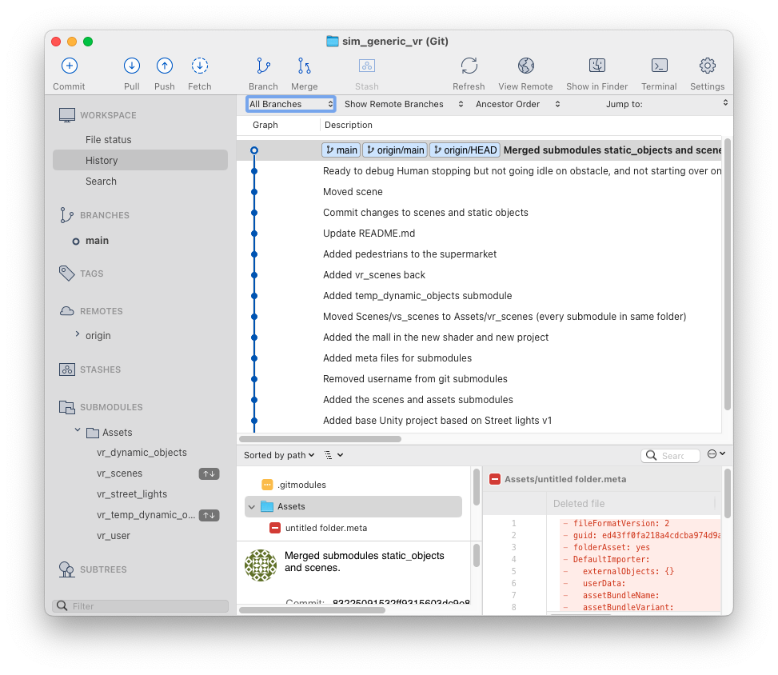

# This is the starting point for the whole WheelSims documentation
# Getting started
# Editing this README
# Unity

[Unity](Unity.md)

Virtual environments are built using Unity and are versioned using several repositories and git submodules.
## Toplevel repositories

Repositories starting by `sim` are toplevel repositories that can be cloned and that correspond to a given wheelchair simulator. Currently, we have:

- `sim_irglm_vr` : The IRGLM simulator.
- `sim_generic_vr` : A generic Unity project that imports every element of the simulators. Use this repository to develop generic WheelSims material that is not related to one given simulator.

## Submodules

In the Assets folder of this repository, there are several git submodules that implement different modular aspects of the simulator:

- `vr_scenes` : This is the main submodule. It contains the scenes to simulate, and most static (non-moving) assets. Static assets are benches, light posts, etc., and they are prefabs that include their geometry, textures and colliders. The scenes generally make references to other contents from the `vr_dynamic_objects`, `vr_street_lights` and `vr_user` submodules.
- `vr_dynamic_objects` : Dynamic objects such as pedestrians and cars, as prefabs that include their geometry, textures, colliders, animators and scripts.
- `vr_street_lights` : Configurable street light and road prefabs that allow interaction with the user with a push button.
- `vr_user` : A game object with basic physics, one main camera and colliders that represents the user in a first-person point of view. This is also where we put the interfacing scripts with external devices, such as DBox, haptics, motion analysis.

## Installing

This repository must be cloned including its submodule, using:

git clone --recurse-submodules git://github.com/wheelsims/sim_generic_vr

If you're using SourceTree, choose New → Clone from URL and fill these informations:

Once cloned, the project looks like this in SourceTree (note the submodules):

In the screenshot above (which was not taken right after a clone), we can see that two submodules need our attention. These ones need both pushes and pulls.

## Updating (pull)

To update the whole project to the newest version, double-click on every submodule to open it in its own window, then pull its changes.

## Editing

When working on the game, one must make sure that the new files (scripts, textures, etc.) added to a scene are placed in the correct folder, so that they will be added to the right repository.

## Committing

To commit the changes, start by commiting and pushing every change to the submodules. Then, commit and push the changes to the main repository.
# Matlab/Simulink
